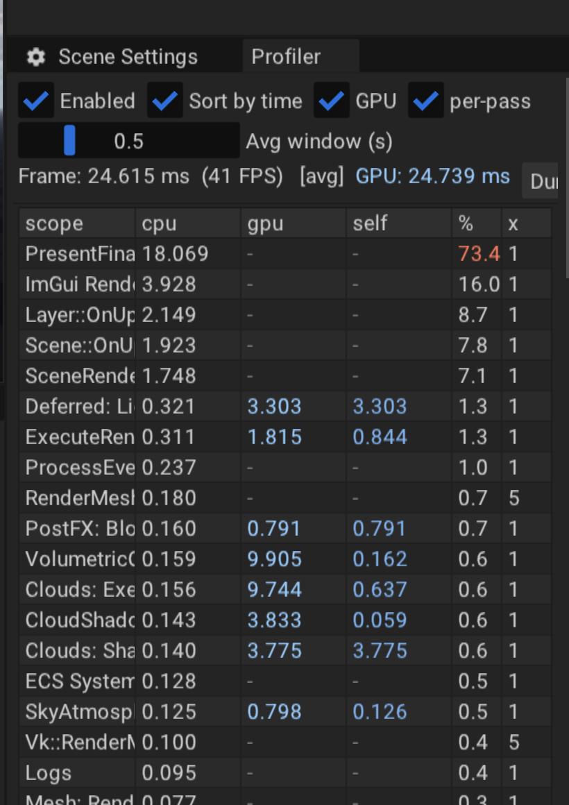

# Per-pass GPU time

Four decisions in the cloud programme were taken on a number that could not see a single pass.

| decision | what was recorded | how it was measured |
|---|---|---|
| shadow ray 6 → 32 samples | ×1.87, 0.230 ms/sample | frame-count slope |
| cloud shadow map on the world | +4.92 ms, ×1.38 | frame-count slope |
| the quality tiers | 17.99 / 14.24 / 8.61 ms | frame-count slope |
| eight hero clouds | 1.39× | frame-count slope |

The slope method is honest and the developers kept its discipline — configurations interleaved in one
session, minimum of N, spread named. But `(t900 - t300) / 600` measures **the whole frame**. It cannot
say whether eighteen milliseconds are the march, the shadow map, the temporal resolve or the composite,
and the tiers were built by distributing a budget nobody had ever seen itemised.

This is the itemisation.

## What it measures, and where to read it

`DESERT_PROFILE_PASS( "name" )` is `DESERT_PROFILE_SCOPE` plus a pair of device timestamps around the
same scope, under the same name. There is no second list of pass names anywhere: the string written at
the site is the string the profiler shows, for both the CPU and the GPU column.

The numbers appear in the editor's **Profiler** panel (View → Profiler), in the same table and the same
row as the CPU time, behind a `GPU` checkbox beside `Enabled`. Comparing the two columns on one frame is
half the point of the feature — `PresentFinalImage (Submit)` costing 14 ms of CPU is not work, it is the
CPU waiting on a GPU that is 17 ms deep.

**Timestamps are OFF until asked for** (see "Why it is OFF by default"). The flags:

| flag | effect |
|---|---|
| `--gpu-profile` | timestamps on, and the table dumped to the log at the end of the run |
| `--gpu-profile --gpu-profile-frame-only` | time the whole frame only — two timestamps, near-free |
| `--gpu-profile --no-gpu-timing` | dump the table with CPU columns only (the B leg of the A/B below) |

A headless `--shot` draws no ImGui, so the log dump is the only way to read the numbers there.

Verified by running the editor and looking at it, not by reasoning about it. Two things that shot
settled and no amount of reading would have:

* **Six columns do not fit the panel's usual dock.** The first build truncated every header to
  `cp… gp… gpu…`, which is unreadable exactly where a reader has to tell the two GPU columns apart.
  The numeric columns are fixed-width now and the scope name stretches; the name clips instead, and
  hovering a row shows it in full — `Clouds: Sha…` and `Clouds: Exe…` are two different passes.
* **The panel aggregates across every live renderer.** That capture reads 24.7 ms against the 18.5 ms
  of a headless shot, because the editor had two scene views open and both were being timed. The
  queries are per (frame × slot) so the views cannot corrupt each other, but the *display* sums rows by
  name, exactly as the CPU column always has. A per-view breakdown would need the panel to pick a slot;
  nothing needs that yet, and it is written down here rather than discovered later.

Use `DESERT_PROFILE_PASS` at **pass** granularity only — a dispatch, a render pass, a stage of the frame.
Inner scopes keep `DESERT_PROFILE_SCOPE`: some of them run hundreds of times a frame, and a timestamp
pair per draw call would cost more than the draw and would say nothing the pass total does not.

## Three decisions that are not obvious

**Keyed by (frame × renderer slot), not by frame.** A query is a per-frame GPU resource written during
recording and read later, so `Docs/RENDERER_FRAME_STATE.md` applies to it in full. The editor runs
several live `SceneRenderer`s — viewport, asset thumbnails, previews — recording into **one** command
buffer in one frame. A pool keyed by frame alone would have the preview's `VolumetricClouds` land on top
of the viewport's, which is the exact shape of the bug that document exists because of, and which shows
up as a plausible wrong number rather than an error. The slot comes from
`EngineContext::GetActiveRendererSlot()`, the same ambient read every other per-frame resource uses.

**Results are read `MaxFramesInFlight` frames late, and never waited on.** `VulkanQueue::Present()`
already calls `vkWaitForFences` on the frame index it is about to reuse, so by the time frame index *f*
begins recording again, everything the GPU was asked to do the last time *f* was used has completed and
its queries are readable. Resolving right there costs nothing and cannot stall — the wait has already
happened, for reasons that have nothing to do with profiling. Reading in the same frame would mean
idling the GPU, which would make the profiler the most expensive pass in the frame it is measuring. On
this swapchain that is **three frames**; the display averages over a 0.5 s window, which is hundreds of
frames, so the lag is invisible in the number.

**Both timestamps at `BOTTOM_OF_PIPE`.** A begin marker at `TOP_OF_PIPE` fires as soon as prior work has
*started*, so every pass would appear to begin at once and the parts would sum to far more than the
whole. At `BOTTOM_OF_PIPE` a scope measures "from when everything before me had finished, to when I had
finished" — the parts then tile the frame and the sum is checkable against it, which is the entire point
of a breakdown.

## The inclusive column cannot be summed

Passes nest: `VolumetricClouds` contains `Clouds: ExecuteInFrame` contains `Clouds: March`. The first
breakdown this feature ever printed added the inclusive times and came to **159 % of its own frame**.

So every row carries a **self** time as well — its own interval with its direct children subtracted. For
any tree whose children lie inside their parents the self times partition the root exactly, and that is
the only column that may be added up. The arithmetic and the query-index layout are pure functions of
integers in `Engine/Graphic/GpuTimestampLayout.hpp`, asserted by `Desert/Tests/Engine/GpuTimestampLayout`
— including the relation that no two `(frame, slot)` pairs can ever reach the same query.

## The eighteen milliseconds, itemised

`Clouds_Demo` at **High**, camera `0,200,0`, `--look 0,0.45,1` — the framing all four decisions above
were measured at, so the two are comparable. Debug build, MoltenVK, machine shared with other agents.
Five interleaved runs of 400 frames; the run with the lowest GPU frame is shown, and the closure figure
held at 91.8–94.7 % across all five.

Percentages are against the **instrumented** frame — see "Two denominators" below for the share of an
uninstrumented one, which is the number budgets are set against.

| pass | gpu self ms | % of GPU frame |
|---|---|---|
| **Clouds: March** | **7.589** | **41.0 %** |
| **Clouds: ShadowMap** | **3.796** | **20.5 %** |
| ExecuteRenderGraph (own work) | 0.835 | 4.5 % |
| PostFX: Bloom | 0.765 | 4.1 % |
| Debug: Overlay | 0.680 | 3.7 % |
| **Clouds: TemporalResolve** | **0.502** | **2.7 %** |
| UI | 0.436 | 2.4 % |
| CloudShadowMap (dispatch overhead) | 0.291 | 1.6 % |
| Deferred: Lighting | 0.216 | 1.2 % |
| Clouds: ExecuteInFrame (barriers) | 0.197 | 1.1 % |
| everything else marked (34 passes) | 1.876 | 10.1 % |
| **unmarked remainder — the instrument itself, see below** | **1.337** | **7.2 %** |
| **GPU frame (instrumented)** | **18.520** | 100 % |

**The cloud subsystem is 12.456 ms.** Everything else marked is 4.7 ms.

The CPU column says something the slope never could: `PresentFinalImage (Submit)` costs ~14 ms of CPU,
and none of it is work — it is the CPU waiting on the fence. The frame is GPU-bound end to end, and the
wall clock and the GPU bracket agree to within 0.5 %.

### The unmarked remainder is the instrument, not the engine

This table first said the remainder was "device work no pass brackets — the ImGui swapchain pass, layout
transitions, the final blit". **That was an assumption and it is wrong.** Measured, one session, four
interleaved passes:

| | GPU frame, min |
|---|---|
| full per-pass marking (~80 timestamps) | 17.106 ms |
| frame bracket only (2 timestamps) | 15.862 ms |
| **cost of the per-pass marks** | **1.244 ms** |

The unmarked remainder in the full configuration is **1.137–1.438 ms**. The per-pass marks cost
**1.244 ms**. They are the same number, and the mechanism says they must be: with both timestamps at
`BOTTOM_OF_PIPE`, a pass's interval ends at its own end mark and the next begins at its own begin mark,
so the encoder split that a Metal counter sample forces lands in the **gap between** them — which is
precisely where "unmarked" is measured.

So the remainder row is the instrument's own footprint. The per-pass figures above are not
correspondingly inflated — the overhead sits between them, not inside them — which is why the
proportions survive even though the total does not.

### Two denominators, and the one budgets are set against

Every percentage has to name its frame, because the instrument inflates the frame it measures by ~8 %.
Same session, three passes:

| | clouds | frame | share |
|---|---|---|---|
| against the **instrumented** frame | 12.148 ms | 17.106 ms | **71 %** (70.8–72.9) |
| against the **uninstrumented** frame | 12.148 ms | 15.862 ms | **77 %** (75.5–77.8) |

**77 % is the number a budget decision is taken on** — it is the share of a frame the player actually
gets, with no profiler running. 71 % is what the panel shows you while you are looking at it, and it is
the smaller number precisely because the act of looking added ~1.2 ms of instrument to the denominator.

Quoting one without the other is how the same measurement reads as "67 %" in one place and "73 %" in
another. Both are right; they answer different questions.

## What this says about the four decisions

**The shadow ray's ×1.87 does not reproduce, and never described the shadow ray.** Varying
`LightMarchSamples` from a scene copy (one field, no rebuild) and reading the march's own line, three
interleaved passes, minimum of three:

| samples | Clouds: March | GPU frame |
|---|---|---|
| 6 | 2.057 ms | 12.732 ms |
| 16 | 3.754 ms | 15.019 ms |
| 32 (shipped) | 6.911 ms | 17.047 ms |
| 64 | 13.071 ms | 22.161 ms |

The march is linear at **0.190 ms/sample** over a **0.918 ms** fixed part (per-interval: 0.170 / 0.197 /
0.193). The record says 0.230 ms/sample — **17 % high**. And 6 → 32 costs **+4.85 ms on the march**,
**+4.32 ms on the whole frame, a ratio of 1.34×** — against a recorded 1.87×.

The ratio was never a property of the shadow ray. It is the ratio of two *whole frames*, and the frame's
fixed cost has roughly doubled since it was taken (12.7 ms at 6 samples today against the 6.95 ms then).
The same code change measured on the same machine gives 1.87× on one tree and 1.34× on another, because
most of what the ratio measures is everything that is *not* the shadow ray. Only the absolute per-sample
cost transfers between trees, and that one is 17 % off.

**The shadow map's +4.92 ms is ~20 % high; the pass costs 3.7 ms.** Reproducing the record's own A/B
(`CastShadows` on/off, one field, no rebuild) but reading the breakdown, three passes, minimum of three:
the whole GPU frame moves **+3.978 ms (1.31×)**, of which **+3.672 ms is the map's own pass**. Pooling
every run in this session, 17 of them, the map's own line is **3.66–4.80 ms, median 3.96** — the recorded
4.92 ms sits *above the entire range*.

A hypothesis, tested and **disproved**: that the missing millisecond was the march paying to *sample* the
map. It is not — the march is 6.553 ms with shadows and 6.670 ms without, a difference of −0.117 ms,
inside its own 15 % run-to-run spread. Sampling the map is free; building it is the whole cost.

**The tier ladder's conclusion survives its arithmetic.** The two knobs the tiers turn — shadow-ray
sample count and shadow-map resolution — are exactly the two largest lines in the frame, 41 % and 20 %.
The ladder was built by distributing a budget nobody had itemised, and the itemisation says it reached
for the right two knobs. Its constants come from the same whole-frame instrument as the two above and
should be expected to carry the same error.

**The hero clouds' 1.39× was not re-measured** — it belongs to `Clouds_HeroMass`, and this table is
`Clouds_Demo`. It rests on the same whole-frame instrument as the other three and deserves the same
re-check.

## What the instrumentation costs

`--no-gpu-timing` against the default, interleaved in one session, five passes, the engine's own
averaged frame clock (which makes the ~20 s startup cancel by construction rather than by subtracting
two runs):

| | frame, min of 5 | spread |
|---|---|---|
| timestamps ON | 18.364 ms | 9.1 % |
| timestamps OFF | 16.218 ms | 16.0 % |

**+2.15 ms on the minima (1.13×); the five per-pass deltas are +0.84, +1.23, +1.77, +2.15, +2.15, mean
+1.63 ms.** An independent two-point frame-count slope taken earlier in the same session gave +1.42 ms.
So: **roughly 1.5 ± 0.6 ms per frame, about 8 % of an 18 ms debug frame**, on a machine shared with other
agents.

Where it goes, measured rather than guessed — the frame bracket against the per-pass marks:

| configuration | GPU frame, min | vs the one below |
|---|---|---|
| full per-pass marking (~80 timestamps) | 17.106 ms | **+1.244 ms** |
| frame bracket only (2 timestamps) | 15.862 ms | free, within noise |
| no timestamps at all | — (wall 16.344 ms) | — |

**Essentially all of it is the per-pass marks; the two-timestamp frame bracket is free.** It is a
MoltenVK number rather than a Vulkan one: `vkCmdWriteTimestamp` becomes a Metal counter sample and a
counter sample can force an encoder boundary, so ~40 pass scopes at ~31 µs apiece is the shape of the
figure. That also explains where the cost lands — in the gaps between passes, which is exactly the
"unmarked remainder" above.

`--gpu-profile-frame-only` and the panel's **per-pass** checkbox exist because of this table: GPU frame
time is available for nothing, and only the itemisation costs.

### Why it is OFF by default

An instrument that inflates its subject by 8 % must not be running when nobody asked. If it were on by
default, every performance number taken in this engine from now on would carry the tax, and sooner or
later somebody would compare an instrumented number against an uninstrumented one — which is precisely
the defect shape this engine has been burned by again and again: two quantities that must agree, and
nothing checking that they do.

So: an ordinary frame is the shipped frame, and measuring is a deliberate act — `--gpu-profile` on the
command line, or the panel's `GPU` checkbox. The switch also skips the pool reset, not just the writes,
so "off" costs exactly nothing rather than nearly nothing.

## Timestamp period

`VkPhysicalDeviceLimits::timestampPeriod` is nanoseconds per tick and differs between devices — it is
**1.0 on MoltenVK**, because Metal counts in nanoseconds already, and tens of nanoseconds on some AMD
parts. It is read into `DeviceCapabilities::TimestampPeriodNs` and logged at startup. A period of 1.0 is
correct here, not a missing conversion; the check that it is *right* is that the whole-frame GPU bracket
agrees with the wall-clock frame time, which it does to well under a per cent.
